# FYRK

## The Digital Family Office — For Everyone

---

# The Problem

## European households are flying blind with their finances.

A typical Nordic household has **2 partners, 4–6 financial providers, 8–12 accounts, 2 pension systems, a mortgage, insurance policies, and shared goals.** Nobody sees the full picture. Nobody coordinates it. Nobody tells them what to do next.

| What they have | Where it lives | Who coordinates it? |
|---|---|---|
| Savings | 2 banks | Nobody |
| Investments | Avanza + Nordnet | Nobody |
| Pensions | PPM + 2 employers + private | Nobody |
| Mortgage | 1 bank | The bank (conflicted) |
| Insurance | 2 providers | Nobody |
| Shared goals | A spreadsheet, maybe | Kitchen arguments |

### The cost of this fragmentation

> Every year, the average Nordic dual-income household loses **~€4,000** to invisible financial drag:
> fee leakage, suboptimal tax-wrapper allocation, insurance gaps, pension misalignment, uncoordinated decisions, and missed opportunities.

They don't know it's happening. No product shows them. No product helps them fix it.

### The 0.01% have a solution. Everyone else doesn't.

Ultra-high-net-worth families have a **family office** — a team of professionals who aggregates, coordinates, and optimizes all household finances as a single operating picture. The service costs **€200K+/year**.

For the other **99.99% of families, nothing exists.**

---

# The Solution

## Fyrk: Household Financial Intelligence

Fyrk is the **first AI-powered financial operating system built for households** — the cross-provider coordination layer that turns fragmented finances into a unified, decision-grade view with collaborative governance and life-event orchestration.

**One place where a household sees everything, plans together, and always knows what to do next.**

### What a family office does → What Fyrk does

| Family Office Function | Fyrk Digital Equivalent |
|---|---|
| "Here's your complete financial picture" | **Household Balance Sheet** — across all providers, both partners, live |
| "A big life event is coming — here's the plan" | **Life Event Engine** — personalized playbooks for property, children, career, retirement |
| "Here's your quarterly performance review" | **Quarterly Review** — automated, comprehensive, with optional human augmentation |
| "Here's how you're doing over time" | **Financial Fitness Score** — 0–1000, trackable, improvable, shared |
| "Let's discuss and approve this decision" | **Household Governance** — proposals, approvals, execution guidance, audit trail |

---

# The Signature UX: The Financial Timeline

Every family office builds an institutional memory. Fyrk's version is **The Financial Timeline** — a chronological, living record of a household's financial life.

```
Past ◄──────────────────────────────────────────────────────► Future

2024 ── ▸ Moved in together
        ▸ Combined budget created
        
2025 ── ▸ 🏠 Home purchase (life event)
        ▸ ▸ Playbook: 12 financial actions sequenced
        ▸ ▸ Outcome: saved 35K vs uncoordinated approach

2026 ── ▸ 👶 First child expected (life event triggered)
        ▸ ▸ Insurance gap detected: 1.2M SEK
        ▸ ▸ Parental leave optimization modeled
        ▸ 📊 Q1 Review: Fitness 720/1000 (↑40)
        ▸ ▸ Fee leakage reduced by 60% vs entry

FUTURE ─ ▸ 🎯 2032: Summer house (goal)
         ▸ 🎯 2047: Early retirement (scenario modeled)
```

The longer a household uses Fyrk, the smarter it gets — and the more impossible it becomes to leave.

---

# Why Now

## Three forces converging in 2026

### 1. FiDA: The EU just mandated open access to ALL financial data

The **Financial Data Access Regulation** (trilogue 2025, implementation 2027–28) legally requires every bank, broker, pension provider, and insurer in Europe to open APIs for customer data sharing.

This is **PSD2 for all of finance.** PSD2 created Tink (acquired for €1.8B). FiDA creates the same opportunity for wealth, pensions, and insurance.

**Before FiDA:** Fyrk relies on CSV imports and manual entry.
**After FiDA:** Fyrk connects every account in one click. The data problem is solved by regulation.

### 2. AI maturity makes the intelligence layer viable

Foundation models (GPT, Claude, Gemini) can now analyze complex financial positions, generate personalized recommendations, and orchestrate multi-step playbooks — at marginal cost. The "digital advisor" that was impossible in 2020 is buildable in 2026.

### 3. Post-pandemic financial anxiety is at all-time highs

Inflation, rate volatility, and cost-of-living pressures have made households acutely aware of their financial fragility. Demand for "am I going to be okay?" tools has never been higher.

> **The window is 18–24 months.** Once FiDA is live, every fintech in Europe will attempt household financial views. The first mover that has the FISP license, the household data, and the user relationships will own the category.

---

# Market Opportunity

## TAM: €8.5B+ in European household wealth services

| Segment | Size | Fyrk's play |
|---|---|---|
| Financial planning & advisory (non-HNW) | €4B | Replace annual advisor meetings with continuous AI |
| Household budgeting & coordination tools | €1.5B | First to combine budgeting + wealth + coordination |
| Pension & retirement planning services | €2B | Cross-provider pension intelligence |
| Financial data aggregation (consumer) | €1B | Intelligence layer, not just aggregation |

### Addressable market (bottoms-up)

| Geography | Dual-income households | Multi-provider (3+) | Addressable | Penetration target (Y5) |
|---|---|---|---|---|
| **Sweden** | 2.1M | ~1.2M | ~600K | 100K (17%) |
| **Nordics** | 5.5M | ~3M | ~1.5M | 250K (17%) |
| **Europe** | 80M+ | ~40M+ | ~15M+ | 1M+ (7%) |

**SAM (Nordics, Year 5): €150M+ ARR**
**TAM (Europe, Year 7+): €1B+ ARR**

---

# Product Architecture

## Five pillars on four data layers

### The Value Stack

```
┌─────────────────────────────────────────────────────────┐
│  INSTITUTIONAL MEMORY                         The moat   │
│  Decision history + life event outcomes + patterns       │
├─────────────────────────────────────────────────────────┤
│  GOVERNANCE                                  The lock-in │
│  Proposals → approvals → execution → tracking            │
├─────────────────────────────────────────────────────────┤
│  ORCHESTRATION                            What they pay  │
│  Life event playbooks + quarterly reviews + assignments   │
├─────────────────────────────────────────────────────────┤
│  INTELLIGENCE                           What impresses   │
│  Fee analysis + risk exposure + pension gaps + fitness    │
├─────────────────────────────────────────────────────────┤
│  AGGREGATION (invisible)                  Infrastructure │
│  FiDA APIs + PSD2 + manual input                         │
└─────────────────────────────────────────────────────────┘
```

> Aggregation is the infrastructure. Intelligence is the impression. Orchestration is the product. Governance is the lock-in. Memory is the moat.

### The Multi-Entity Model

```
┌────────────────────────────────────────────────────┐
│  CIRCLE (Friends / Colleagues / Investment clubs)   │
│  ┌────────────────────────────────────────────┐     │
│  │  EXTENDED FAMILY (Parents / Siblings)       │     │
│  │  ┌────────────────────────────────────┐     │     │
│  │  │  HOUSEHOLD (Partners + Dependents)  │     │     │
│  │  │  ┌──────────────────────────┐       │     │     │
│  │  │  │  INDIVIDUAL (You)        │       │     │     │
│  │  │  └──────────────────────────┘       │     │     │
│  │  └────────────────────────────────────┘     │     │
│  └────────────────────────────────────────────┘     │
└────────────────────────────────────────────────────┘

  Free           €30/mo          +€15/member       Free/€10
  (acquisition)  (core revenue)  (expansion)       (viral growth)
```

---

# Business Model

## Subscription SaaS — value anchored to peace of mind, not basis points

| Tier | Price | What you get | Target |
|---|---|---|---|
| **Free** | €0 | Individual balance sheet + basic Financial Fitness score | Anyone — acquisition funnel |
| **Household** | €29/mo | Unified household view, Timeline, events, fitness, governance | Core paying customer |
| **Household Pro** | €59/mo | + Quarterly Review (AI) + optimization engine + advanced analytics | Engaged households |
| **Household Premium** | €149/quarter | + Human-augmented quarterly review with coordinator | Higher-net-worth |

### Revenue expansion paths

| Path | Mechanism | Revenue potential |
|---|---|---|
| Individual → Household | "Add your partner" natural upsell | 2x revenue per acquisition |
| Household → Extended Family | Inheritance, eldercare, estate planning | +€15/member/mo |
| Household → Pro/Premium | Quarterly review upgrades | 2–5x ARPU increase |
| Circles (free) | Viral growth → household conversions | €0 CAC leads |
| B2B data products (Year 3+) | Anonymized household intelligence for institutions | New revenue stream |

---

# Go-To-Market

## Sweden first. Then Nordics. Then Europe.

### Phase 1: Sweden wedge (Year 1)

**Target:** Tech-savvy dual-income households (Stockholm, Gothenburg, Malmö) with 3+ financial providers.

**Channels:**
- Content-led: "The true cost of uncoordinated household finances" — blog, social, PR
- Community-driven: Swedish personal finance communities (RikaTillsamman, Flashback, Reddit r/privatekonomi)
- Referral: household invites (Partner A → Partner B) + circle invites
- Partner: financial influencers focused on "cost literacy" and "financial independence"

**Key activation metric:** % of sign-ups who add a second household member within 7 days.

### Phase 2: Nordics expansion (Year 2–3)

Norway, Denmark, Finland — similar broker/wrapper structures, similar consumer expectations, same regulatory framework (EU/EEA).

### Phase 3: European scale (Year 3–5)

FiDA enables pan-European data access. Expand to Germany, Netherlands, France — largest markets with highest fragmentation.

---

# Competitive Landscape

## Fyrk occupies whitespace no one else can reach

```
                    INDIVIDUAL ◄────────────────────► HOUSEHOLD
                         │                                │
      PASSIVE            │                                │
      (Show data)        │   Mint (dead)                  │
                         │   Tink (infra)        No one   │
                         │   Sharesight                   │
                         │                                │
      ───────────────────┼────────────────────────────────│
                         │                                │
      ACTIVE             │   Robo-advisors                │
      (Decide + act)     │   (Betterment,         ✦ FYRK │
                         │    Wealthsimple)               │
                         │                                │
                         │   Private Banking              │
                         │   (€1M+ minimum)               │
```

| Competitor | What they do | Why Fyrk wins |
|---|---|---|
| **Avanza / Nordnet** | Single-broker portfolio | Walled garden; can't see across providers or households |
| **Banks (SEB, Nordea)** | In-house wealth "advice" | Conflicted; only recommend own products |
| **Mint / Money Dashboard** | Account aggregation | Dead/dying. Aggregation without action = no business |
| **Robo-advisors** | Automated investing | Individual only; no household coordination; regulatory burden |
| **Private Banking** | Full service | €1M+ minimum; prohibitively expensive; still single-institution |
| **Spreadsheets** | DIY tracking | What 80% of target users do today — and hate |

---

# The Moat

## Five layers of defensibility that compound over time

### 1. Regulatory first-mover (FISP license under FiDA)

FiDA creates a new licensed entity: **Financial Information Service Provider**. Fyrk applies early, builds compliance infrastructure first, establishes regulator relationships. Every month ahead = structural advantage.

### 2. Proprietary data no one else can collect

| Data layer | Who has it | Can competitors get it? |
|---|---|---|
| Account data | Everyone (post-FiDA) | ✅ Yes — not a moat |
| Cross-provider correlation | Only Fyrk | ❌ Need same user consent across providers |
| Household relationship data | Only Fyrk | ❌ No one else operates at household level |
| Decision context (why, not what) | Only Fyrk | ❌ Requires unique product mechanic |
| Life event → financial outcome data | Only Fyrk over time | ❌ Requires years of compound data |

### 3. Household network effects

Each household member increases value for every other member. Extended family links create multi-generational lock-in. Circles create zero-cost viral acquisition.

### 4. Time-based switching cost

| Time in Fyrk | What's accumulated | Can they take it? |
|---|---|---|
| 1 year | Timeline, decisions, fitness trend | Painful to lose |
| 3 years | Life events, quarterly reviews, patterns | Irreplaceable |
| 5 years | Generational links, proven wisdom | Institutional |

### 5. Intelligence flywheel

More households → better playbooks → higher value → more households. By Year 3, Fyrk has seen thousands of "buying first apartment" events and knows exactly what to recommend.

---

# Roadmap

## From prototype to ARR-machine in 24 months

### Phase 0: Prototype (Months 1–3) — **NOW**
```
BUILD:  Financial Timeline + sample household
        Quarterly Review generator (automated)
        One life event playbook ("Buying first apartment")
        Financial Fitness Score (v0)
        Household governance flow (propose → approve)

PROVE:  "This is what a Digital Family Office feels like"
        → Demo-ready for investor conversations
```

### Phase 1: Private Beta (Months 4–6)
```
BUILD:  PSD2 bank connections (cash accounts)
        Manual + CSV ingestion for investments
        Household onboarding flow
        Weekly "What Changed" push notifications
        FISP license application submitted

TARGET: 50 households, 100 users
METRIC: Weekly retention >60%, Quarterly Review completion >80%
```

### Phase 2: Public Beta — Sweden (Months 7–12)
```
BUILD:  Life event library (10 events)
        Full Quarterly Review with recommendations
        Extended Family linking  
        Circles (v0, anonymous benchmarking)
        Premium tier: human-augmented quarterly review

TARGET: 1,000 households
METRIC: Conversion free→paid >8%, NPS >50
REVENUE: MRR ~€30K (by month 12)
```

### Phase 3: Growth — Nordics (Months 13–24)
```
BUILD:  FiDA API integrations (investments, pensions)
        Expanded life event library (25+ events)
        AI copilot for natural language financial questions
        B2B data product (anonymized household intelligence)
        Multi-language: NO, DK, FI

TARGET: 10,000 households (Nordics)
METRIC: NDR >120%, ARPU >€40/mo
REVENUE: ARR ~€5M (by month 24)
```

### Phase 4: Scale — Europe (Months 24–48)
```
BUILD:  Pan-European FiDA coverage
        Market-specific wrappers/tax/pension modules
        Enterprise partnerships (banks, insurers as distribution)
        Advanced AI: predictive household modeling

TARGET: 50,000+ households (Europe)
REVENUE: ARR €20–50M (by month 48)
```

---

# Unit Economics

## Strong fundamentals from day one

| Metric | Beta | Year 2 | Year 4 (at scale) |
|---|---|---|---|
| **CAC** | €30 (organic/content) | €60 (blended) | €80 (paid channels) |
| **ARPU** | €29/mo | €40/mo (tier mix) | €50/mo (premium growth) |
| **Gross Margin** | 85% | 82% (human reviews) | 80% |
| **Payback** | 1 month | 1.5 months | 2 months |
| **LTV (36-mo)** | €880 | €1,200 | €1,500 |
| **LTV:CAC** | 29x | 20x | 19x |
| **Monthly Churn** | 3% (beta) | 2% | 1.5% |

**Why churn stays low:** You're not canceling an app — you're abandoning your family's financial history, your partner's shared workspace, and 2 years of institutional memory.

### Path to €50M ARR

| Milestone | Households | ARPU | ARR |
|---|---|---|---|
| Month 12 | 1,000 | €29 | €350K |
| Month 24 | 10,000 | €40 | €4.8M |
| Month 36 | 30,000 | €45 | €16.2M |
| Month 48 | 60,000 | €50 | €36M |
| Month 60 | 100,000 | €55 | €66M |

---

# Financial Projections

## Conservative scenario (Nordics only through Year 3)

| | Year 1 | Year 2 | Year 3 | Year 4 | Year 5 |
|---|---|---|---|---|---|
| **Paying households** | 500 | 5,000 | 20,000 | 50,000 | 100,000 |
| **ARPU (€/mo)** | 29 | 35 | 42 | 48 | 55 |
| **ARR** | €175K | €2.1M | €10M | €29M | €66M |
| **Gross Margin** | 85% | 82% | 80% | 80% | 80% |
| **OpEx** | €800K | €2.5M | €6M | €12M | €20M |
| **EBITDA** | -€650K | -€800K | €2M | €11M | €33M |
| **Headcount** | 5 | 15 | 35 | 60 | 100 |

**Breakeven:** Month ~30 (mid-Year 3).
**B2B data revenue** (not modeled above) provides additional upside from Year 3+.

---

# Risks & Mitigations

| Risk | Severity | Mitigation |
|---|---|---|
| **FiDA delayed** | High | MVP works on manual/CSV/PSD2. FiDA is an accelerant, not a dependency. |
| **User apathy** ("I don't care enough") | High | Lead with anxiety reduction, not optimization. Life events create urgency. |
| **Regulatory classification as advisor** | Medium | Position as information service (FISP), not advisory. Show math, not "should." |
| **Incumbent response** | Medium | Incumbents are conflicted and single-provider. Cross-provider neutrality is unchallengeable. |
| **Data quality / trust** | Medium | Transparency-first: show confidence, freshness, assumptions. Conservative estimates. |
| **AI commoditization** | Low | AI is the engine, not the moat. Proprietary data is the moat. |

---

# Team

> [!NOTE]
> *Customize with founding team backgrounds.*

### What this team needs

| Role | Why critical |
|---|---|
| **Founder / CEO** | PM background in banking + wealth. Understands the institutional side. Building for the consumer side. Founder-market fit. |
| **CTO / Technical Co-founder** | Full-stack + AI/ML. Can build the Timeline, AI copilot, and FiDA integration layer. |
| **Head of Compliance** (advisor or fractional) | Navigate FISP licensing, Finansinspektionen relationship, regulatory positioning. |
| **Design Lead** (hire #1 or #2) | The product *must* feel premium, calm, trust-inducing. Design IS the brand. |

### Founder-market fit

A product manager from Nordic banking who has seen the institutional side — the conflicts, the opacity, the under-served middle — and is building the tool that should exist. At the exact moment regulation unlocks the data.

---

# The Ask

## Raising €1.5–2M Pre-Seed

| Use of Funds | Allocation | Purpose |
|---|---|---|
| **Engineering** | 50% (€750K–1M) | Core platform: Timeline, AI engine, household governance, FiDA-ready architecture |
| **Design & Product** | 20% (€300–400K) | Premium UX, onboarding, life event playbooks, quarterly review templates |
| **Compliance & Legal** | 15% (€225–300K) | FISP license application, regulatory counsel, data privacy infrastructure |
| **GTM & Operations** | 15% (€225–300K) | Content marketing, community, early partnerships, operational setup |

### Milestones to Seed (12–18 months)

- [ ] **1,000 paying households** with >60% weekly retention
- [ ] **FISP license** application submitted / in process
- [ ] **NPS >50** and organic referral rate >30%
- [ ] **MRR €30K+** with clear path to €100K MRR within 6 months
- [ ] **3 life event playbooks** with measured household impact
- [ ] **Quarterly Review** with >80% completion and >70% action rate

---

# The Vision

## In 5 years, every European household has a financial home.

Today, household finances are scattered across a dozen providers, managed in spreadsheets and kitchen arguments, with zero coordination; decisions are made in the dark.

Fyrk changes this. One place where a household **sees everything**, **plans together**, and **gets smarter every year**. Every life event has a playbook. Every quarter has a review. Every decision has a history. Every household has a financial fitness score trending upward.

**We're not building a better tracker, a cheaper advisor, or a smarter app.
We're creating a new category: Household Financial Intelligence.
The family office — for everyone.**

---

# Appendix

## A. Category Definition

> **Household Financial Intelligence** is the practice of managing a household's complete financial life — across all providers, all asset types, all family members — as a continuous, collaborative, AI-augmented operating system.

## B. The Moat Flywheel

```mermaid
flowchart TD
    A["More households join"] --> B["More decision + event data"]
    B --> C["Smarter playbooks + recommendations"]
    C --> D["Higher value per household"]
    D --> E["Higher retention + WTP"]
    E --> F["More revenue → invest in growth"]
    F --> A
    B --> G["Better anonymized benchmarks"]
    G --> H["B2B data product"]
    H --> F
```



## C. Regulatory Timeline

| Regulation | Status (Feb 2026) | Fyrk impact |
|---|---|---|
| **PSD2** | Live | Bank account access (cash) — available now |
| **PSD3/PSR** | Final text expected 2025, application ~2027 | Enhanced payment data access |
| **FiDA** | Trilogue 2025, adoption ~2026, implementation ~2027–28 | **Investments, pensions, insurance data access** |
| **DORA** | Live Jan 2025 | ICT resilience requirements for financial entities |

## D. Comparable Exits & Valuations

| Company | Category | Exit/Valuation | Relevance |
|---|---|---|---|
| **Tink** | Open Banking infra | €1.8B (Visa acquisition) | PSD2 enabler → FiDA is the next wave |
| **Wealthsimple** | Robo-advisory | $5B valuation | Individual wealth; Fyrk = household |
| **Mint** | Aggregation | $170M (Intuit) | Aggregation without action → undervalued |
| **Plaid** | Financial data infra | $13B valuation | Data layer play; Fyrk = intelligence layer |
| **Kubera** | Wealth tracking (US) | $50M+ (growing) | Closest comp; individual-only, US-only |

## E. Positioning Statements (by audience)

| Audience | Statement |
|---|---|
| **Consumers** | "Your household's financial home — see everything, decide together, get smarter over time" |
| **Investors** | "The Digital Family Office for non-HNW European households — AI-powered, cross-provider, household-native" |
| **Regulators** | "A Financial Information Service Provider helping households make informed decisions through transparent data aggregation and analysis" |
| **Press** | "Fyrk brings family-office-level financial coordination to every household — no minimum net worth required" |
